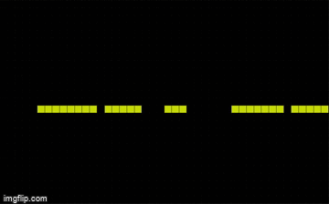

# Game of Life

Implementação do *[Conway's Game of Life](https://pt.wikipedia.org/wiki/Jogo_da_vida)* em web browser usando JavaScript, para acessá-la clique [aqui](https://eduardo-candioto-fidelis.github.io/game-of-life/index.html).

## Objetivo

Este projeto tem como objetivo praticar JavaScript.

## Tecnologias Usadas

- JavaScript
- HTML
- CSS

## Como Funciona

O *Conway's Game of Life* é um autómato celular, que consiste em uma grade de quadrados onde alguns estão acesos e outros apagados, a cada nova rodada regras são aplicadas a todos os quadrados, assim definindo quais ficarão acesos ou apagados. Para mais informações clique [aqui](https://pt.wikipedia.org/wiki/Jogo_da_vida).

Na tela inicial do jogo há dois botões **Start** e **Random**. No começo todos os quadrados estão apagados e o usuário pode clicar em qualquer um para acendê-lo, e clicar em **Start** para começar. Já clicando em **Random** os quadrados iniciais são acesos e apagados aleatoriamente.

 
*Usuário clicando.*

 
*Gerando aleatoriamente.*

## Licença
MIT